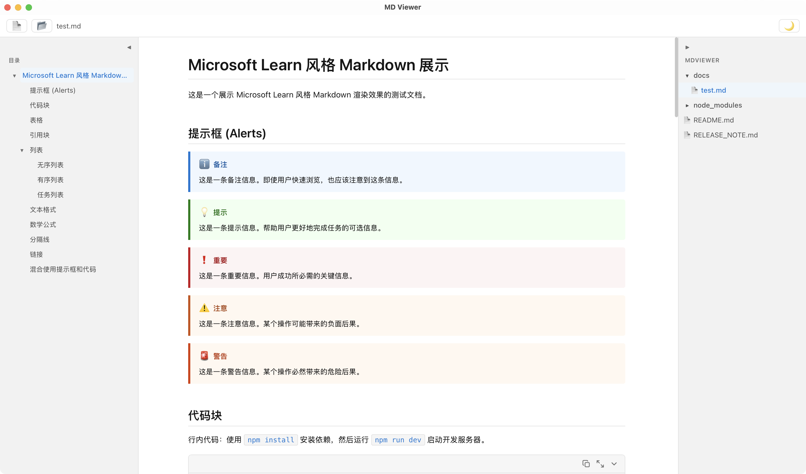

# MD Viewer

A minimal desktop Markdown reader built with Tauri + React + TypeScript.

<p align="center">
  
</p>

## Features

- **Markdown Rendering** — Powered by react-markdown with GFM support (tables, task lists, strikethrough, etc.) and Emoji
- **Table of Contents** — Auto-generated TOC sidebar on the left with click-to-jump, scroll-aware highlighting, and drag-to-resize
- **File Explorer** — Right-side file tree that recursively lists all Markdown files in a directory, with auto-refresh on filesystem changes
- **Code Highlighting** — Syntax highlighting via highlight.js with automatic language detection
- **Math Formulas** — KaTeX-based rendering for both inline and block math expressions
- **Mermaid Diagrams** — Supports flowcharts, sequence diagrams, Gantt charts, and more
- **Theme Switching** — Light / dark theme toggle with automatic preference persistence
- **Live Reload** — Automatically refreshes preview when the file is modified externally
- **Smart Link Navigation** — Relative `.md` links open within the app; external URLs open in the system browser
- **Local Image Support** — Renders relative-path images embedded in Markdown via Tauri asset protocol

## Tech Stack

| Layer | Technology |
|-------|------------|
| Desktop Framework | [Tauri v1](https://v1.tauri.app/) |
| Frontend | React 19 + TypeScript |
| Build Tool | Vite 7 |
| Markdown | react-markdown + remark-gfm + remark-math |
| Code Highlighting | rehype-highlight + highlight.js |
| Math | rehype-katex + KaTeX |
| HTML Support | rehype-raw |
| Diagrams | Mermaid |
| File Watching | notify + notify-debouncer-mini |
| Directory Scanning | walkdir |
| Package Manager | pnpm |

## Project Structure

```
mdviewer/
├── index.html                    # Entry HTML
├── package.json
├── pnpm-workspace.yaml
├── tsconfig.json                 # TypeScript config
├── tsconfig.node.json            # Node-side TS config (for Vite)
├── vite.config.ts                # Vite config
├── public/                       # Static assets
├── src/                          # Frontend source
│   ├── main.tsx                  # App entry, global style imports
│   ├── App.tsx                   # Root component, file handling & layout
│   ├── components/
│   │   ├── FileExplorer.tsx      # Right-side file tree browser
│   │   ├── MarkdownRenderer.tsx  # Markdown rendering core (all plugins)
│   │   ├── Mermaid.tsx           # Mermaid diagram component
│   │   ├── Sidebar.tsx           # Left-side TOC navigation (drag-to-resize)
│   │   └── Toolbar.tsx           # Top toolbar (open file/folder & theme toggle)
│   ├── hooks/
│   │   └── useTheme.ts          # Light/dark theme management
│   └── styles/
│       └── index.css            # Global styles & CSS variable themes
└── src-tauri/                   # Tauri / Rust backend
    ├── Cargo.toml               # Rust dependencies
    ├── tauri.conf.json          # Tauri app config (window, permissions, etc.)
    ├── build.rs                 # Tauri build script
    ├── src/
    │   └── main.rs              # Rust entry (file/dir watching, directory scan)
    └── icons/                   # App icon assets
```

## Prerequisites

- [Node.js](https://nodejs.org/) >= 18
- [pnpm](https://pnpm.io/) >= 8
- [Rust](https://www.rust-lang.org/tools/install) >= 1.70
- Tauri v1 system dependencies (see [Tauri Prerequisites](https://v1.tauri.app/v1/guides/getting-started/prerequisites))

## Development

```bash
# Install frontend dependencies
pnpm install

# Start development mode (launches Vite dev server + Tauri window)
pnpm tauri dev
```

In development mode, frontend changes are hot-reloaded via Vite HMR, and Rust code changes trigger automatic recompilation.

To debug the frontend only (without the Tauri window):

```bash
pnpm dev
# Open http://localhost:1420 in your browser
```

## Build & Package

```bash
# Production build (frontend + Rust compilation + installer packaging)
pnpm tauri build
```

Build artifacts are located at `src-tauri/target/release/bundle/`:

| Platform | Output | Path |
|----------|--------|------|
| macOS | `.app` + `.dmg` | `bundle/macos/` and `bundle/dmg/` |
| Windows | `.msi` + `.exe` | `bundle/msi/` and `bundle/nsis/` |
| Linux | `.deb` + `.AppImage` | `bundle/deb/` and `bundle/appimage/` |

### Cross-Compilation

Tauri builds for the current platform by default. For cross-compilation, add the corresponding Rust target:

```bash
# Example: Build for Apple Silicon on macOS
rustup target add aarch64-apple-darwin
pnpm tauri build --target aarch64-apple-darwin

# Example: Build for Intel on macOS
rustup target add x86_64-apple-darwin
pnpm tauri build --target x86_64-apple-darwin

# Build Universal Binary (Intel + Apple Silicon)
pnpm tauri build --target universal-apple-darwin
```

### Customization

Edit the following fields in `src-tauri/tauri.conf.json`:

- `package.productName` — Application name
- `package.version` — Version number
- `tauri.bundle.identifier` — Unique app identifier (e.g. `com.yourname.mdviewer`)
- `tauri.bundle.icon` — App icons

### CI/CD

Refer to the official [Tauri GitHub Actions guide](https://v1.tauri.app/v1/guides/building/cross-platform) for multi-platform automated builds and releases.

## Troubleshooting

### macOS: "mdviewer is damaged and can't be opened"

This happens because the app is not signed with an Apple Developer certificate. macOS Gatekeeper blocks unsigned apps downloaded from the internet.

To fix, run in Terminal:

```bash
/usr/bin/xattr -cr /Applications/mdviewer.app
```

Then open the app again normally.

## License

[Apache License 2.0](LICENSE)
