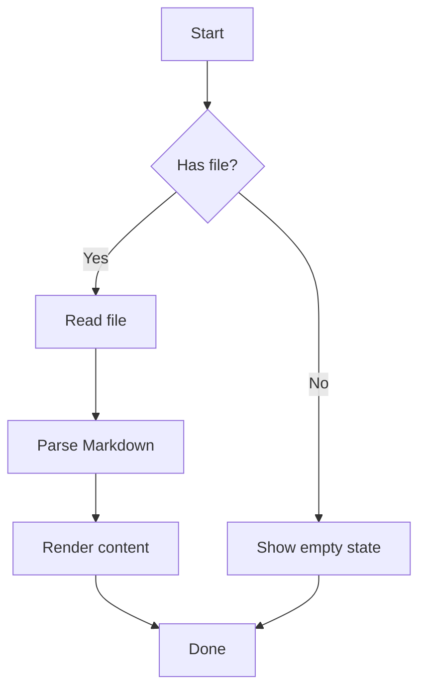
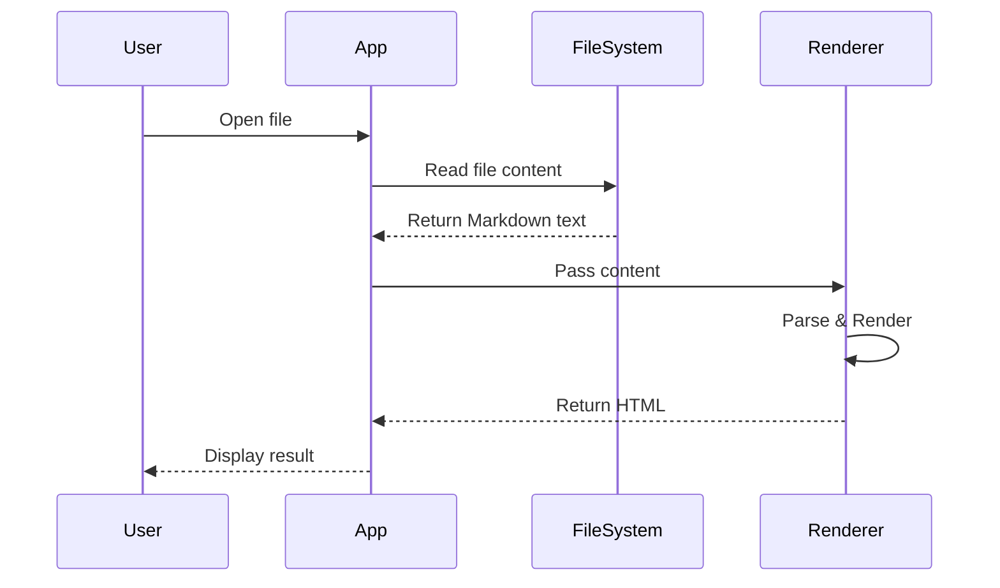
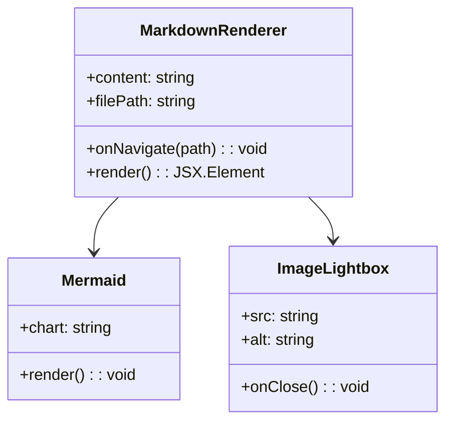
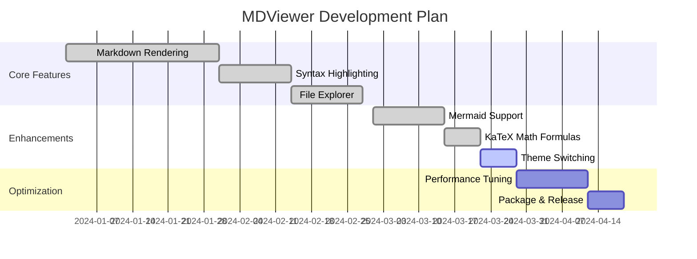
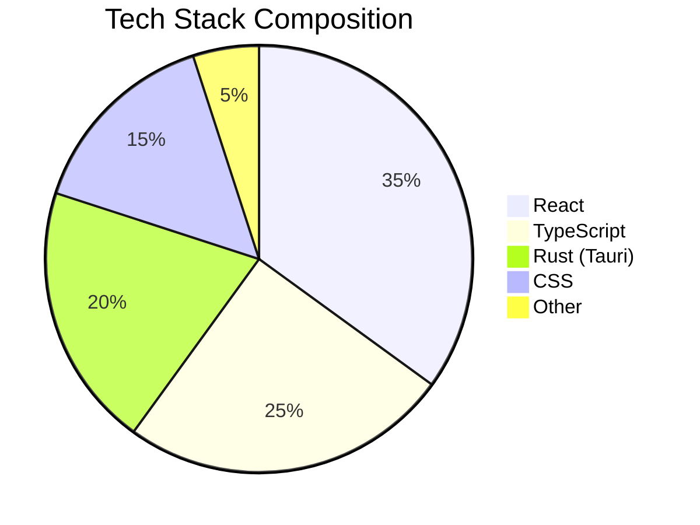
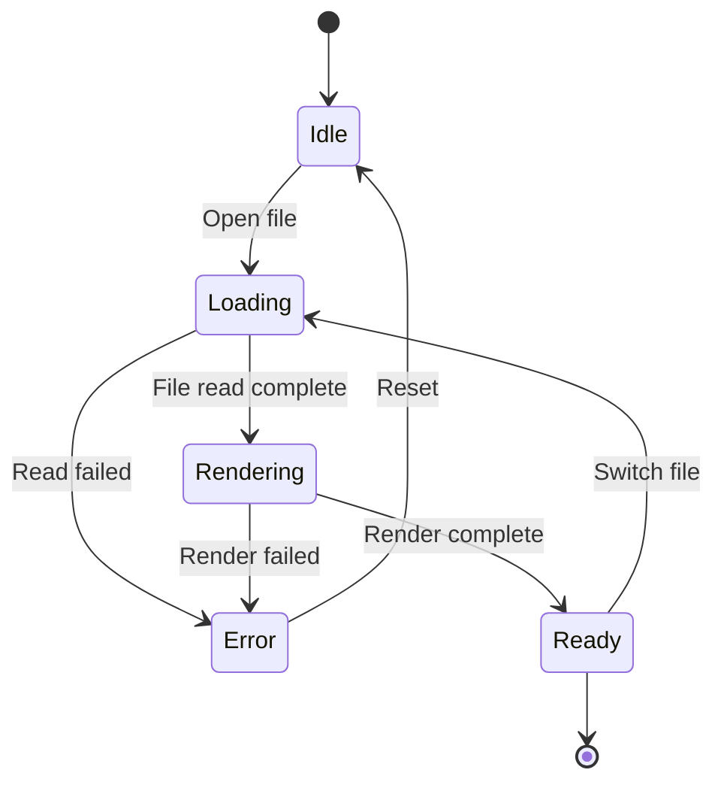

# MDViewer Feature Test Document

This document contains various Markdown scenarios to test the rendering capabilities and compatibility of mdviewer.

---

## 1. Heading Levels

# Heading Level 1
## Heading Level 2
### Heading Level 3
#### Heading Level 4
##### Heading Level 5
###### Heading Level 6

---

## 2. Text Formatting

**Bold text** and *italic text* and ***bold italic text***

~~Strikethrough text~~

This is a paragraph with `inline code` inside it.

> This is a blockquote.
>
> Blockquotes can span multiple paragraphs.

> Nested blockquotes
>> Second level
>>> Third level

---

## 3. Lists

### Unordered List

- Item one
- Item two
  - Sub-item A
  - Sub-item B
    - Deeper level
- Item three

### Ordered List

1. First step
2. Second step
   1. Sub-step 2.1
   2. Sub-step 2.2
3. Third step

### Task List (GFM)

- [x] Completed task
- [x] Another completed task
- [ ] Incomplete task
- [ ] Yet another incomplete task

---

## 4. Links

### Standard Links

[GitHub](https://github.com)

[Link with title](https://github.com "GitHub Homepage")

### Autolinks (GFM)

https://www.example.com, addtional string here.

https://www.example.com，额外的中文。

### Anchor Links

[Jump to Tables section](#5-tables-gfm)

[Jump to Code Blocks](#6-code-blocks)

---

## 5. Tables (GFM)

### Basic Table

| Feature | Status | Notes |
|---------|--------|-------|
| Markdown rendering | ✅ | Core feature |
| Syntax highlighting | ✅ | Uses highlight.js |
| Math formulas | ✅ | KaTeX |
| Mermaid diagrams | ✅ | Lazy loaded |

### Column Alignment

| Left Aligned | Center Aligned | Right Aligned |
|:-------------|:--------------:|--------------:|
| Left | Center | Right |
| Data | Data | Data |
| More | More | More |

### Complex Table Content

| Feature | Example | Description |
|---------|---------|-------------|
| Bold | **bold** | Bold inside table |
| Code | `code` | Inline code in table |
| Link | [link](https://example.com) | Link inside table |
| Strikethrough | ~~deleted~~ | Strikethrough in table |

---

## 6. Code Blocks

### No Language Specified

```
This is a code block without a language tag.
Plain text content here.
No syntax highlighting applied.
```

### JavaScript

```javascript
// Async function example
async function fetchData(url) {
  try {
    const response = await fetch(url);
    if (!response.ok) {
      throw new Error(`HTTP error! status: ${response.status}`);
    }
    const data = await response.json();
    return data;
  } catch (error) {
    console.error('Fetch failed:', error);
    throw error;
  }
}

// Arrow functions and destructuring
const processItems = (items) => {
  return items
    .filter(({ active }) => active)
    .map(({ name, value }) => `${name}: ${value}`)
    .join('\n');
};
```

### TypeScript

```typescript
interface User {
  id: number;
  name: string;
  email: string;
  roles: Role[];
}

type Role = 'admin' | 'editor' | 'viewer';

class UserService {
  private users: Map<number, User> = new Map();

  async getUser(id: number): Promise<User | undefined> {
    return this.users.get(id);
  }

  async createUser(data: Omit<User, 'id'>): Promise<User> {
    const id = Date.now();
    const user: User = { id, ...data };
    this.users.set(id, user);
    return user;
  }
}
```

### Python

```python
from dataclasses import dataclass
from typing import Optional, List

@dataclass
class Config:
    host: str = "localhost"
    port: int = 8080
    debug: bool = False
    workers: Optional[int] = None

def fibonacci(n: int) -> List[int]:
    """Generate the Fibonacci sequence."""
    if n <= 0:
        return []
    sequence = [0, 1]
    while len(sequence) < n:
        sequence.append(sequence[-1] + sequence[-2])
    return sequence[:n]

# List comprehension and generators
squares = [x**2 for x in range(10) if x % 2 == 0]
lazy_squares = (x**2 for x in range(1000000))
```

### Rust

```rust
use std::collections::HashMap;

#[derive(Debug, Clone)]
struct Document {
    title: String,
    content: String,
    metadata: HashMap<String, String>,
}

impl Document {
    fn new(title: &str, content: &str) -> Self {
        Self {
            title: title.to_string(),
            content: content.to_string(),
            metadata: HashMap::new(),
        }
    }

    fn word_count(&self) -> usize {
        self.content.split_whitespace().count()
    }
}

fn main() {
    let mut doc = Document::new("Hello", "Hello, world!");
    doc.metadata.insert("author".to_string(), "Rust".to_string());
    println!("Word count: {}", doc.word_count());
}
```

### HTML

```html
<!DOCTYPE html>
<html lang="en">
<head>
  <meta charset="UTF-8">
  <meta name="viewport" content="width=device-width, initial-scale=1.0">
  <title>Test Page</title>
  <style>
    .container { max-width: 800px; margin: 0 auto; }
  </style>
</head>
<body>
  <div class="container">
    <h1>Hello World</h1>
    <p>This is a test page.</p>
  </div>
</body>
</html>
```

### CSS

```css
:root {
  --primary-color: #3498db;
  --font-size-base: 16px;
}

.markdown-body {
  font-family: -apple-system, BlinkMacSystemFont, 'Segoe UI', sans-serif;
  line-height: 1.6;
  color: var(--text-color, #333);
}

@media (prefers-color-scheme: dark) {
  :root {
    --primary-color: #5dade2;
  }
}
```

### JSON

```json
{
  "name": "mdviewer",
  "version": "1.0.0",
  "description": "A markdown viewer built with Tauri",
  "features": ["syntax-highlighting", "mermaid", "katex", "gfm"],
  "config": {
    "theme": "auto",
    "fontSize": 16,
    "lineNumbers": true
  }
}
```

### Shell / Bash

```bash
#!/bin/bash

# Variables and conditionals
PROJECT_DIR="${HOME}/projects/mdviewer"

if [ ! -d "$PROJECT_DIR" ]; then
  echo "Creating project directory..."
  mkdir -p "$PROJECT_DIR"
fi

# Loops and pipes
find . -name "*.md" -type f | while read -r file; do
  echo "Processing: $file"
  wc -l "$file"
done

# Functions
deploy() {
  local env="${1:-production}"
  echo "Deploying to $env..."
  pnpm build && pnpm tauri build
}
```

### SQL

```sql
-- Create table
CREATE TABLE documents (
    id SERIAL PRIMARY KEY,
    title VARCHAR(255) NOT NULL,
    content TEXT,
    created_at TIMESTAMP DEFAULT CURRENT_TIMESTAMP,
    updated_at TIMESTAMP DEFAULT CURRENT_TIMESTAMP
);

-- Complex query
SELECT
    d.title,
    d.content,
    COUNT(t.id) AS tag_count,
    STRING_AGG(t.name, ', ') AS tags
FROM documents d
LEFT JOIN document_tags dt ON d.id = dt.document_id
LEFT JOIN tags t ON dt.tag_id = t.id
WHERE d.created_at > NOW() - INTERVAL '30 days'
GROUP BY d.id, d.title, d.content
HAVING COUNT(t.id) > 0
ORDER BY d.created_at DESC
LIMIT 20;
```

### YAML

```yaml
name: Release
on:
  push:
    tags:
      - 'v*'

jobs:
  build:
    strategy:
      matrix:
        platform: [macos-latest, ubuntu-latest, windows-latest]
    runs-on: ${{ matrix.platform }}
    steps:
      - uses: actions/checkout@v4
      - name: Build
        run: pnpm tauri build
```

---

## 7. Math Formulas (KaTeX)

### Inline Math

Einstein's mass-energy equivalence: $E = mc^2$

Quadratic formula: $x = \frac{-b \pm \sqrt{b^2 - 4ac}}{2a}$

Euler's identity: $e^{i\pi} + 1 = 0$

### Block Math

$$
\int_{-\infty}^{\infty} e^{-x^2} dx = \sqrt{\pi}
$$

$$
\sum_{n=1}^{\infty} \frac{1}{n^2} = \frac{\pi^2}{6}
$$

$$
\nabla \times \mathbf{E} = -\frac{\partial \mathbf{B}}{\partial t}
$$

### Matrix

$$
\mathbf{A} = \begin{pmatrix}
a_{11} & a_{12} & a_{13} \\
a_{21} & a_{22} & a_{23} \\
a_{31} & a_{32} & a_{33}
\end{pmatrix}
$$

### Multi-line Aligned Equations

$$
\begin{aligned}
f(x) &= (x+1)^2 \\
     &= x^2 + 2x + 1 \\
     &= (x+1)(x+1)
\end{aligned}
$$

---

## 8. Mermaid Diagrams

### Flowchart



### Sequence Diagram



### Class Diagram



### Gantt Chart



### Pie Chart



### State Diagram



---

## 9. Emoji (Gemoji)

### Emoji Symbols

:smile: :heart: :thumbsup: :rocket: :star:

:warning: :bulb: :memo: :bug: :fire:

:white_check_mark: :x: :question: :exclamation: :zap:

### Emoji in Context

This feature is great :thumbsup:, let's keep improving :rocket:

---

## 10. Alert Callouts (GitHub / Microsoft Learn Style)

> [!NOTE]
> This is a note callout. Use it to provide additional context or background information.

> [!TIP]
> This is a tip callout. Use it to share useful advice or best practices.

> [!IMPORTANT]
> This is an important callout. Use it to highlight critical information that should not be overlooked.

> [!CAUTION]
> This is a caution callout. Use it to warn users about potential issues or things to be careful about.

> [!WARNING]
> This is a warning callout. Use it to flag dangerous operations or actions that may cause data loss.

---

## 11. Images

### Remote Image (Exists)


### Image with Alt Text (Exists)


### Local Image (Exists)


### Local Image (Does Not Exist)


### Remote Image (Does Not Exist)


---

## 12. Horizontal Rules

Three different horizontal rule syntaxes:

---

***

___

---

## 13. Inline HTML (rehype-raw)

<details>
<summary>Click to expand/collapse content</summary>

This is a collapsible content area that can contain:

- List items
- **Formatted text**
- `Code snippets`

```javascript
console.log("Code block inside a collapsible section");
```

</details>

<details>
<summary>Another collapsible section - FAQ</summary>

**Q: What formats does MDViewer support?**

A: It supports standard Markdown, GFM extensions, math formulas, Mermaid diagrams, and more.

**Q: How do I switch themes?**

A: Click the theme toggle button in the sidebar.

</details>

### Keyboard Shortcuts

<kbd>Ctrl</kbd> + <kbd>C</kbd> Copy

<kbd>Ctrl</kbd> + <kbd>V</kbd> Paste

<kbd>Cmd</kbd> + <kbd>Shift</kbd> + <kbd>P</kbd> Command Palette

### Mark, Subscript, and Superscript

This is <mark>highlighted</mark> text.

H<sub>2</sub>O is the chemical formula for water.

x<sup>2</sup> + y<sup>2</sup> = z<sup>2</sup>

---

## 14. Footnotes (GFM)

This is a paragraph with a footnote reference[^1]. Here is another footnote[^note].

[^1]: This is the content of the first footnote.
[^note]: This is a named footnote with a more detailed explanation.

---

## 15. Long Content & Scroll Testing

### Long Paragraph

Lorem ipsum dolor sit amet, consectetur adipiscing elit. Sed do eiusmod tempor incididunt ut labore et dolore magna aliqua. Ut enim ad minim veniam, quis nostrud exercitation ullamco laboris nisi ut aliquip ex ea commodo consequat. Duis aute irure dolor in reprehenderit in voluptate velit esse cillum dolore eu fugiat nulla pariatur. Excepteur sint occaecat cupidatat non proident, sunt in culpa qui officia deserunt mollit anim id est laborum.

Curabitur pretium tincidunt lacus. Nulla gravida orci a odio. Nullam varius, turpis et commodo pharetra, est eros bibendum elit, nec luctus magna felis sollicitudin mauris. Integer in mauris eu nibh euismod gravida. Duis ac tellus et risus vulputate vehicula. Donec lobortis risus a elit. Etiam tempor. Ut ullamcorper, ligula ut dictum pharetra, nisi nunc fringilla magna, in commodo elit erat sit amet risus.

### Long Code Block (Collapse/Expand Test)

```typescript
// This is a long code block to test the collapse/expand functionality
import { useState, useEffect, useCallback, useMemo, useRef } from 'react';

interface DataItem {
  id: string;
  title: string;
  description: string;
  tags: string[];
  createdAt: Date;
  updatedAt: Date;
  status: 'active' | 'archived' | 'deleted';
}

interface PaginationState {
  page: number;
  pageSize: number;
  total: number;
  hasMore: boolean;
}

interface FilterOptions {
  search: string;
  status: DataItem['status'] | 'all';
  tags: string[];
  dateRange: { start: Date | null; end: Date | null };
}

function useDataManager(initialFilters: Partial<FilterOptions> = {}) {
  const [items, setItems] = useState<DataItem[]>([]);
  const [loading, setLoading] = useState(false);
  const [error, setError] = useState<Error | null>(null);
  const [pagination, setPagination] = useState<PaginationState>({
    page: 1,
    pageSize: 20,
    total: 0,
    hasMore: true,
  });
  const [filters, setFilters] = useState<FilterOptions>({
    search: '',
    status: 'all',
    tags: [],
    dateRange: { start: null, end: null },
    ...initialFilters,
  });

  const abortControllerRef = useRef<AbortController | null>(null);

  const fetchData = useCallback(async (page: number) => {
    if (abortControllerRef.current) {
      abortControllerRef.current.abort();
    }
    abortControllerRef.current = new AbortController();

    setLoading(true);
    setError(null);

    try {
      const params = new URLSearchParams({
        page: String(page),
        pageSize: String(pagination.pageSize),
        search: filters.search,
        status: filters.status,
      });

      const response = await fetch(`/api/items?${params}`, {
        signal: abortControllerRef.current.signal,
      });

      if (!response.ok) throw new Error('Failed to fetch');

      const data = await response.json();
      setItems(prev => page === 1 ? data.items : [...prev, ...data.items]);
      setPagination(prev => ({
        ...prev,
        page,
        total: data.total,
        hasMore: data.items.length === prev.pageSize,
      }));
    } catch (err) {
      if (err instanceof Error && err.name !== 'AbortError') {
        setError(err);
      }
    } finally {
      setLoading(false);
    }
  }, [filters, pagination.pageSize]);

  const filteredItems = useMemo(() => {
    return items.filter(item => {
      if (filters.status !== 'all' && item.status !== filters.status) return false;
      if (filters.tags.length > 0 && !filters.tags.some(t => item.tags.includes(t))) return false;
      return true;
    });
  }, [items, filters]);

  useEffect(() => {
    fetchData(1);
    return () => abortControllerRef.current?.abort();
  }, [fetchData]);

  return { items: filteredItems, loading, error, pagination, filters, setFilters, fetchData };
}

export default useDataManager;
```

---

## 16. Special Characters & Escaping

### Escaped Characters

\*This is not italic\*

\# This is not a heading

\[This is not a link\](url)

### Special Symbols

Copyright © | Trademark ™ | Registered ® | Degree 45°

Arrows: → ← ↑ ↓ ↔ ⇒ ⇐

Math: ≈ ≠ ≤ ≥ ± ∞ ∑ ∏ √

Currency: $ € £ ¥ ₹

---

## 17. Mixed Content Stress Test

### Complex Content in Tables

| # | Feature | Formula | Status |
|---|---------|---------|--------|
| 1 | Area calculation | $A = \pi r^2$ | :white_check_mark: |
| 2 | Velocity formula | $v = \frac{ds}{dt}$ | :white_check_mark: |
| 3 | Energy conservation | $E_k + E_p = const$ | :warning: |

### Nested Elements in Lists

1. **First item** - contains `code` and a [link](https://example.com)
   - Sub-item with math formula $f(x) = x^2$
   - Sub-item with ~~strikethrough~~
2. Second item with emoji :star:
3. Third item with a nested code block
   ```python
   # Code block inside a list
   print("Hello from nested code block")
   ```
4. Fourth item - contains <kbd>shortcut</kbd> and <mark>highlight</mark>

---

## 18. Typography & Layout

### Mixed Language Text

The `useState` Hook in React allows function components to manage state. Combined with `useEffect`, you can handle side effects such as API calls and DOM manipulation.

Tauri is a cross-platform desktop application framework built with Rust. Compared to Electron, it offers a smaller bundle size and better performance.

### Punctuation

English punctuation: , . ! ? ; : " " ' ' [ ] < > ( ) - ...

Special: & @ # % ^ * ~ ` | / \\

### Long URL Line-Break Test

Here is a very long URL: https://www.example.com/very/long/path/that/should/wrap/properly/in/the/markdown/viewer/without/breaking/the/layout

---

## 19. Edge Cases

### Empty Code Block

```
```

### Single Column Table

| Column |
|--------|
| Data   |

### Deeply Nested Blockquotes

> Level 1
>> Level 2
>>> Level 3
>>>> Level 4
>>>>> Level 5

### Consecutive Headings (No Content Between)

#### Heading A
#### Heading B
#### Heading C

### Very Long Words (No-Wrap Test)

Pneumonoultramicroscopicsilicovolcanoconiosis

Supercalifragilisticexpialidocious

### Empty Link and Image

[Empty link]()


---

## 20. Comprehensive Verification Checklist

If all the content above renders correctly, the following MDViewer features are working:

- [x] Heading levels and anchor navigation
- [x] Text formatting (bold, italic, strikethrough, inline code)
- [x] Blockquotes and nested quotes
- [x] Ordered / unordered / task lists
- [x] Links (external, anchor, autolinks)
- [x] GFM tables (alignment, complex content)
- [x] Code block syntax highlighting (multiple languages)
- [x] Math formulas (inline & block KaTeX)
- [x] Mermaid diagrams (flowchart, sequence, class, gantt, pie, state)
- [x] Emoji rendering
- [x] Alert callout blocks
- [x] Images and Lightbox
- [x] Inline HTML (details/summary, kbd, mark, sub/sup)
- [x] Footnotes
- [x] Special characters and escaping
- [x] Typography and mixed content layout
- [x] Long content scrolling and code collapse
- [x] Edge case handling
